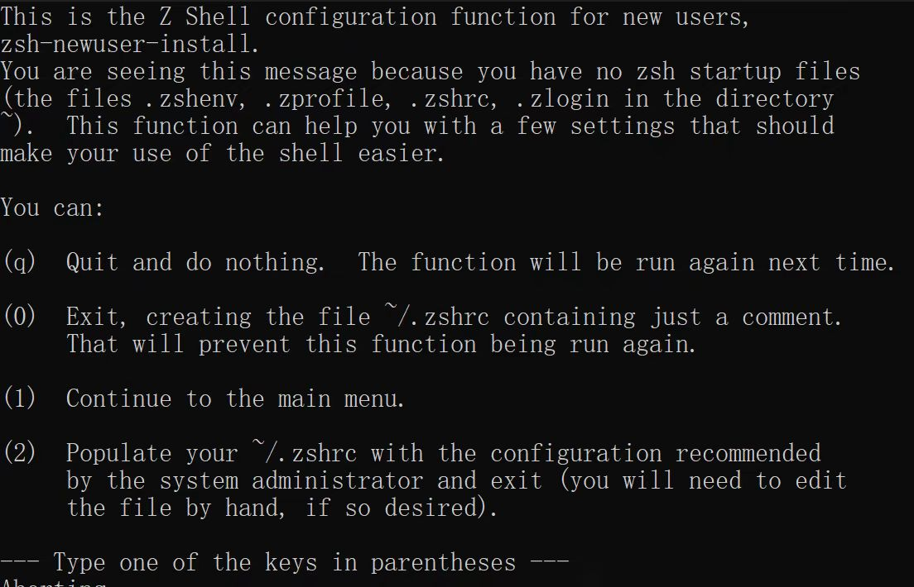

## Ubuntu 虚拟机安装

#### 第一步：打开powershell管理员模式

方法：按 win + X，选择带有“管理员”字样的那个

#### 第二步：安装wsl & Ubuntu

前提：开梯子
方法：运行以下命令

    ```powershell
    wsl --install -d Ubuntu
    ```
#### 第三步：按照提示操作即可

## zsh 基础环境

### 基础环境

#### 第一步：安装zsh

```shell
sudo apt update
```
```shell
sudo apt-get install zsh
```

#### 第二步：将zsh设置为默认终端

```shell
chsh -s $(which zsh)
```

再打开一个ubuntu的terminal，你将看到如下内容，证明以上步骤均成功



按照上图中他的提示做即可，建议输入：

```shell
0
```

#### 第三步：安装oh-my-zsh

!!! warning "注意"

    - 以下命令选一个即可

    - VPN在虚拟机不能同步（似乎v2rayN支持ubuntu但是我没有尝试），所以开梯子没啥用，那么，等到某个风和日丽的日子可能就成功了（from gsgg）


```shell
# 用curl
sh -c "$(curl -fsSL https://raw.githubusercontent.com/ohmyzsh/ohmyzsh/master/tools/install.sh)"
```
```shell
# 用wget
sh -c "$(wget -O- https://raw.githubusercontent.com/ohmyzsh/ohmyzsh/master/tools/install.sh)"
```
```shell
# 换gitee源
sh -c "$(curl -fsSL https://gitee.com/mirrors/oh-my-zsh/raw/master/tools/install.sh)"
```

```shell
# 换清华源
sh -c "$(curl -fsSL https://mirrors.tuna.tsinghua.edu.cn/github-raw/ohmyzsh/ohmyzsh/master/tools/install.sh)"
```

```shell
# 换浙大源
sh -c "$(curl -fsSL https://mirrors.zju.edu.cn/oh-my-zsh/oh-my-zsh/master/tools/install.sh)"
```

#### 第四步：配置zsh

用vim打开~./zshrc

```shell
vim ~./zshrc
```

- vim 命令：详见[我的vim笔记](https://r-z-zhang-ai.github.io/CS/Tools/vim/)

- 主题：在 `ZSH_THEME` 处更改，我使用的是agnoster
- 插件：可自行搜索，我使用了`zsh-autosuggestions`（命令建议）、`zsh-syntax-highlighting`（语法高亮）、`zsh-history-substring-search`（命令建议）

    - 先在 `plugins=(git)` 处添加这三个
    - 再退出vim，按如下命令安装：

        !!! info "注"

            此处只给出直接 git clone 的方法，也可以换源，一个方法不行就换另一个，同时建议开流量 ~

        - zsh-autosuggestions
            ```shell
            git clone https://github.com/zsh-users/zsh-autosuggestions ${ZSH_CUSTOM:-~/.oh-my-zsh/custom}/plugins/zsh-autosuggestions
            ```

        - zsh-syntax-highlighting
            ```shell
            git clone https://github.com/zsh-users/zsh-syntax-highlighting ${ZSH_CUSTOM:-~/.oh-my-zsh/custom}/plugins/zsh-syntax-highlighting
            ```

        - zsh-history-substring-search
            ```shell
            git clone https://github.com/zsh-users/zsh-history-substring-search ${ZSH_CUSTOM:-~/.oh-my-zsh/custom}/plugins/zsh-history-substring-search
            ```
        
- 字体和其他设置：我使用的是JetBrains Mon

    - 首先，在[官网](https://www.jetbrains.com/lp/mono/)下载并在文件夹（path-to-downloaded-files\JetBrainsMono-2.304\fonts\ttf）中选择你喜欢的那个，点开，点击安装

    - 其次，打开命令提示符，在上栏下拉菜单进入设置，进入ubuntu，在“外观”处设置字体和其他内容

## zsh使用小记

### 安装 anaconda

缘起：anaconda 作为一款虚拟环境管理软件，极其强大，必须安装！

下载安装脚本：
```bash
# 使用 wget
wget https://repo.anaconda.com/archive/Anaconda3-2023.07-1-Linux-x86_64.sh

# or 使用 curl
curl -O https://repo.anaconda.com/archive/Anaconda3-2023.07-1-Linux-x86_64.sh
```


运行安装脚本

```bash
bash Anaconda3-2023.07-1-Linux-x86_64.sh
```

!!! warning "warning"

    这里一定要用 `bash` 而不能用 `zsh`，因为 `zsh` 对语法的检查比 `bash` 严格，导致安装脚本中 `Anaconda3-2023.07-1-Linux-x86_64.sh:377: no matches found: /home/rzzhang/download/anaconda3/pkgs/envs/*/` 文件无法夹正确下载，就是通配符检查的问题。

一直输入 yes 

输入新安装路径 : `/home/<user-name>/download/anaconda3`。


安装完成后，安装程序会提示你是否将 Anaconda 添加到环境变量中：
```
Do you wish the installer to initialize Anaconda3 by running conda init? [yes|no]
```
输入 `yes`


重新加载 .zshrc 文件以激活环境变量
```bash
source ~/.zshrc
```

验证安装

```bash
conda --version
```


### 安装 chromium

缘起：运行我的烟花代码以展示之。

!!! warning "warning"

    pip 是 Python 的包管理工具，用于安装 Python 库和工具。然而，Chromium 浏览器和 ChromeDriver并不是 Python 库，而是 Linux 系统的软件包，需要通过系统的包管理器（如 apt）来安装，不能通过 pip 直接安装。    

第一步：通过 apt 包管理器安装 chromium & chromedriver

```shell
sudo apt update
```
```shell
sudo apt install chromium-browser
```
```shell
sudo apt install chromium-chromedriver
```

第二步：验证安装：启动 chromium，检查 chromedriver 版本

```shell
chromium-browser
```
```shell
chromedriver --version
```

由于Ubuntu默认使用snap下载chromium，所以即使用该方法也会自动调用snap，如果没有则会下载它。

> 默认使用 Snap 是因为维护成本低、自动更新方便、跨平台支持好、依赖管理简单且安全性高。

最终，chromium被安装在 ~/snap/chromium 目录下。

第三步：在虚拟环境中安装相关python包，`pip3 install <package-name>` 即可

- webdriver-manager （自动管理 chromedriver）

- selenium 实现 Web 应用程序的自动化测试（模拟用户在浏览器中的操作，如点击按钮、填写表单、导航页面等）


!!! info "后记"

    俗话说，一杯茶一根烟 一个环境配一天。
    在配置linux环境过程中，最容易出现的问题（个人遇到的）是网络连接障碍，可尝试：连接手机热点 or 换源 or 换件别的事干干（

